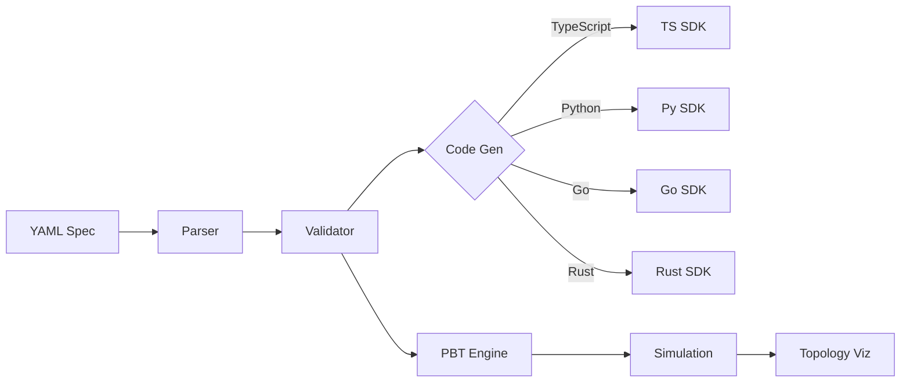

# Protocol Resurrection Machine - Workbench

> **Transform legacy protocols into modern, type-safe implementations across multiple languages**

A powerful web-based IDE for creating, validating, and testing protocol specifications with real-time code generation, property-based testing, and interactive topology visualization.

---

## 🚀 Quick Start

```bash
# 1. Install dependencies
npm install

# 2. Start the dev server
npm run dev

# 3. Open http://localhost:5173
```

**That's it!** Start creating protocols in the web-based editor.

---

## ✨ Key Features

### 🎨 **Modern IDE Experience**
- **Responsive layout**: Three-pane desktop layout with bottom navigation on mobile
- **Mobile-optimized**: Touch-friendly interface with tab-based navigation (< 768px)
- **Live validation**: Real-time YAML validation with inline diagnostics
- **Syntax highlighting**: CodeMirror 6 with protocol-aware completion
- **Dark/Light/Halloween themes**: Full theme support with custom aesthetics

### 🔄 **Multi-Language Code Generation**
Generate production-ready SDKs in:
- **TypeScript** - Type-safe client/server implementations
- **Python** - Async-ready with type hints
- **Go** - High-performance, idiomatic Go code  
- **Rust** - Memory-safe, zero-cost abstractions

### 🧪 **Property-Based Testing**
- **Automated scenario generation**: Smart fuzzing based on protocol spec
- **Quickcheck integration**: Rigorous validation of implementations
- **Simulation playback**: Visual replay of test scenarios
- **Coverage reports**: Identify edge cases

### 📊 **Interactive Topology Diagrams**
- **Auto-detected architectures**: IoT (Dendrite), Chat (Mesh), Banking (Pipeline)
- **Live animation**: Visual feedback during simulations
- **Mermaid-powered**: Beautiful, scalable diagrams
- **Theme-aware**: Adapts to current theme

### 🔍 **Protocol Discovery**
- **Fingerprint matching**: Automatically detect legacy protocols
- **Network sniffing**: Analyze live traffic patterns
- **Preset library**: Gopher, Finger, WAIS, Archie, and more
- **Custom fingerprints**: Add your own protocol signatures

---

## 📸 Screenshots

### Main Workbench Interface


### Topology Visualization


### Simulation Playback


---

## 🏗️ Architecture



**Components**:
- **Frontend**: SvelteKit + Tailwind CSS + CodeMirror
- **Backend**: Node.js API routes
- **Validation**: Custom YAML parser with semantic analysis
- **Code Gen**: Template-based multi-target compiler
- **Testing**: Property-based testing with Quickcheck
- **Visualization**: Mermaid diagrams with custom styling

---

## 📱 Mobile Support

The workbench is fully responsive and optimized for mobile devices:

### Desktop (≥ 768px)
- **Three-pane split layout**: Editor | Code Viewer | Console
- **Resizable panes**: Drag dividers to adjust layout
- **Activity bar**: Quick access to different views

### Mobile (< 768px)
- **Bottom navigation**: Three tabs - Editor, Output, Console
- **Full-screen views**: Each tab uses the full viewport
- **Touch-optimized**: 44px minimum touch targets
- **Vertical scrolling**: Editor supports pan-y touch gestures

**Tip**: The layout automatically switches when you resize your browser window across the 768px breakpoint.

---

## 📖 Use Cases

### 1. **Modernize Legacy Protocols**
Convert old binary protocols (Gopher, Finger) into modern REST/GraphQL equivalents with automatic SDK generation.

### 2. **IoT Device Communication**
Define sensor protocols with automatic validation and type-safe client libraries for embedded devices.

### 3. **Microservice Contracts**
Specify inter-service communication protocols with guaranteed compatibility across language boundaries.

### 4. **Network Protocol Research**
Rapidly prototype and test new protocol designs with automated property-based testing.

---

## 🛠️ Technology Stack

| Component | Technology |
|-----------|-----------|
| **Frontend Framework** | SvelteKit 2.x + TypeScript |
| **Styling** | Tailwind CSS v4 |
| **Code Editor** | CodeMirror 6 |
| **Diagrams** | Mermaid.js |
| **Build Tool** | Vite 7.x |
| **Testing** | Quickcheck (PBT) |
| **Package Manager** | npm/pnpm |

---

## 📚 Documentation

- **[Usage Guide](./docs/USAGE.md)** - Step-by-step tutorials and workflows
- **[API Reference](./docs/API.md)** - Complete API documentation
- **[Examples](./static/presets/)** - Sample protocols (Gopher, Chat, Banking)
- **[Mobile Plan](./MOBILE_PLAN.md)** - Responsive design roadmap

---

## 🎯 Roadmap

- [x] Core editor with live validation
- [x] Multi-language code generation
- [x] Property-based testing
- [x] Topology visualization
- [x] Protocol discovery
- [x] Mobile-responsive UI with bottom navigation
- [ ] Topology animations (in progress)
- [ ] Enhanced documentation generation
- [ ] PWA support with offline mode
- [ ] Collaborative editing (WebSocket)
- [ ] Plugin system for custom validators
- [ ] VS Code extension

---

## 🤝 Contributing

Contributions welcome! See [CONTRIBUTING.md](./CONTRIBUTING.md) for guidelines.

**Areas we need help**:
- Additional protocol fingerprints
- Code generation templates for new languages (Java, C#, etc.)
- UI/UX improvements
- Documentation and tutorials

---

## 📜 License

MIT License - see [LICENSE](./LICENSE) for details

---

## 🌟 Star Us!

If you find this project useful, please consider giving it a star ⭐ on GitHub!

---

**Built with ❤️ by the Protocol Resurrection team**
