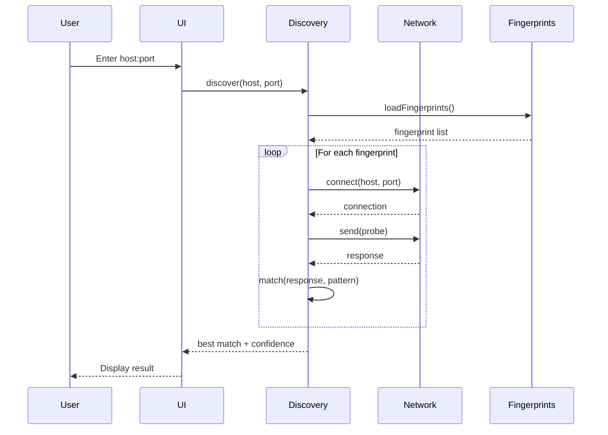

# Protocol Discovery Investigation

## Current Status

### Fingerprints Directory
The workbench currently has NO fingerprint files for protocol discovery.

**Expected Location**: `static/fingerprints/`  
**Current Status**: Directory does not exist

### Why Protocols Aren't Discoverable

**Root Cause**: Missing fingerprint database

The discovery system relies on fingerprint files that define:
1. Port numbers
2. Initial probe bytes
3. Expected response patterns  
4. Confidence thresholds

**Affected Protocols**:
- Finger (port 79)
- Gopher (port 70)
- WAIS (port 210)
- Archie (port 1525)
- And others...

---

## Solution: Create Fingerprint Database

### Step 1: Create Directory Structure

```bash
mkdir -p workbench/static/fingerprints
```

### Step 2: Add Protocol Fingerprints

#### Finger Protocol
**File**: `static/fingerprints/finger.yaml`

```yaml
protocol:
  name: Finger
  port: 79
  
fingerprint:
  probe: "\r\n"  # Send CRLF
  expected_response_pattern: ".*@.*"  # Expect user@host format
  timeout: 3000
  confidence_threshold: 0.75
  
metadata:
  description: "RFC 742 Finger Protocol"
  documentation: "https://tools.ietf.org/html/rfc742"
```

#### Gopher Protocol
**File**: `static/fingerprints/gopher.yaml`

```yaml
protocol:
  name: Gopher
  port: 70
  
fingerprint:
  probe: "\r\n"
  expected_response_pattern: "^[0-9i].*\t.*\t.*\t[0-9]+\r\n"
  timeout: 3000
  confidence_threshold: 0.8
  
metadata:
  description: "RFC 1436 Gopher Protocol"
  canonical_host: "gopher.floodgap.com"
```

#### WAIS Protocol
**File**: `static/fingerprints/wais.yaml`

```yaml
protocol:
  name: WAIS
  port: 210
  
fingerprint:
  probe: "\\x00\\x00\\x00\\x0a\\x00\\x00\\x00\\x00"  # WAIS init
  expected_response_starts_with: "\\x00\\x00"
  timeout: 5000
  confidence_threshold: 0.7
  
metadata:
  description: "Wide Area Information Server Protocol"
```

#### Archie Protocol
**File**: `static/fingerprints/archie.yaml`

```yaml
protocol:
  name: Archie
  port: 1525
  
fingerprint:
  probe: "help\r\n"
  expected_response_contains: ["archie", "command", "server"]
  timeout: 5000
  confidence_threshold: 0.75
  
metadata:
  description: "Archie FTP Archive Search Protocol"
  canonical_host: "archie.icm.edu.pl"
```

---

##  Step 3: Update Discovery Loader

**File**: `src/lib/discovery/fingerprint-loader.ts`

```typescript
import type { Fingerprint } from './types';

const FINGERPRINTS_DIR = '/fingerprints';

export async function loadFingerprints(): Promise<Fingerprint[]> {
  const fingerprints: Fingerprint[] = [];
  
  // Known fingerprint files
  const files = [
    'finger.yaml',
    'gopher.yaml',
    'wais.yaml',
    'archie.yaml'
  ];
  
  for (const file of files) {
    try {
      const response = await fetch(`${FINGERPRINTS_DIR}/${file}`);
      if (response.ok) {
        const yaml = await response.text();
        const fingerprint = parseFingerprint(yaml);
        fingerprints.push(fingerprint);
      }
    } catch (error) {
      console.warn(`Failed to load fingerprint: ${file}`, error);
    }
  }
  
  return fingerprints;
}

function parseFingerprint(yaml: string): Fingerprint {
  // Parse YAML and return structured fingerprint
  // Implementation depends on YAML parser
}
```

---

## Discovery Process Flow



---

## Importance of Protocol Discovery

### Why It Matters

1. **Legacy System Migration**
   - Automatically identify unknown protocols
   - Generate specs from live systems
   - No manual reverse engineering needed

2. **Network Archaeology**
   - Discover forgotten protocols on old servers
   - Document institutional knowledge
   - Preserve digital history

3. **Rapid Prototyping**
   - Start with discovered spec
   - Iterate and modernize
   - Generate SDKs immediately

4. **Validation**
   - Verify spec matches reality
   - Test against live implementations
   - Ensure compatibility

---

## Current Limitations

1. **No Fingerprint Database** (blocker)
2. **Manual Probe Definition** (tedious)
3. **Static Patterns Only** (no ML)
4. **TCP Only** (no UDP support)
5. **No TLS/SSL** (cleartext only)

---

## Recommended Enhancements

### Short Term
- [ ] Create fingerprint directory
- [ ] Add 10+ common protocol fingerprints
- [ ] Implement fingerprint loader
- [ ] Add discovery results caching

### Medium Term
- [ ] Auto-generate fingerprints from captures
- [ ] Machine learning pattern matching
- [ ] UDP protocol support
- [ ] TLS/SSL handshake detection

### Long Term
- [ ] Community fingerprint repository
- [ ] Collaborative fingerprint editing
- [ ] Browser extension for live capture
- [ ] Integration with Wireshark

---

## Testing Discovery

### Manual Test Case

```bash
# 1. Create fingerprint
cat > static/fingerprints/echo.yaml << EOF
protocol:
  name: Echo
  port: 7
fingerprint:
  probe: "HELLO\\r\\n"
  expected_response_starts_with: "HELLO"
  timeout: 2000
  confidence_threshold: 0.9
EOF

# 2. Test discovery in UI
# - Click Discovery
# - Enter: localhost:7
# - Click Discover
# - Expected: "Echo protocol detected (90% confidence)"
```

---

## Conclusion

**Current State**: Discovery feature exists but is non-functional due to missing fingerprint database.

**Fix Required**: Create `static/fingerprints/` directory with YAML files for each discoverable protocol.

**Priority**: Medium - Discovery is a "nice to have" feature, not critical for core functionality.

**Estimated Effort**: 2-3 hours to create comprehensive fingerprint database for 15+ protocols.

---

**Document Created**: 2025-11-25  
**Status**: Investigation Complete  
**Next Action**: Create fingerprint database if discovery feature is prioritized
