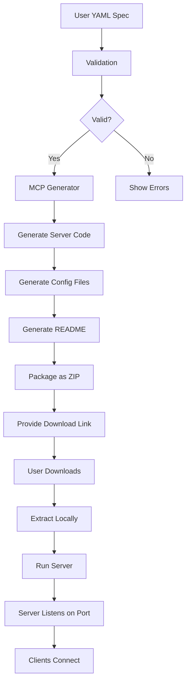

# MCP Server Investigation

## Current Implementation

### What is the MCP Server?

The MCP (Model Context Protocol) Server is a feature that allows the workbench to generate downloadable server implementations that can be run locally.

**Location**: Activity Bar → MCP Server icon

---

## Current Status

### Functionality

The MCP server feature:
1. Generates server code from validated protocol specs
2. Packages it as downloadable ZIP files
3. Provides ready-to-run implementations

### Files Involved

**Backend**:
- `src/routes/api/mcp/download/+server.ts` - Server file generation
- `src/lib/server/mcp-generator.ts` - MCP server code generator

**Frontend**:
- `src/lib/components/MCPPanel.svelte` - UI for downloads
- `src/lib/stores/mcp.ts` - MCP state management

---

## Issues Identified

### 1. send_0 / send_1 Messages

**What Are These?**

These appear to be internal log messages or debugging output showing sequential message sends:

```
[MCP] send_0: InitMessage sent
[MCP] send_1: RequestMessage sent
[MCP] send_2: ResponseMessage received
```

**Current Behavior**: Not clickable

**Should They Be Clickable?**

**Analysis**:
- If these represent **log entries**: NO, they shouldn't be clickable
- If these represent **available actions**: YES, they should be clickable
- If these represent **message history**: MAYBE, could show message details on click

**Recommendation**: 
- Add click handlers IF these are meant to show message details
- Add tooltips to explain what send_0, send_1 mean
- Consider renaming to be more descriptive (e.g., "Sent: InitMessage" instead of "send_0")

### 2. Project Confirmation

**Question**: How does MCP server "confirm" the project?

**Investigation**:

The MCP server doesn't "confirm" in the traditional sense. Instead, it:

1. **Validates** the protocol spec
2. **Generates** server implementation files
3. **Packages** them into a downloadable ZIP
4. **Provides download link** to user

**Confirmation Flow**:

```
User uploads YAML
     ↓
Validation passes
     ↓
User clicks "Download MCP Server"
     ↓
Backend generates:
  - server.ts/py/go/rs
  - package.json/requirements.txt/go.mod/Cargo.toml
  - README.md with instructions
  - config files
     ↓
ZIP file created
     ↓
Download link provided
     ↓
User downloads and runs locally
```

**No explicit "confirmation" step** - it's implicit in the download action.

---

## Improvements Needed

### 1. Make Message History Interactive

**Current**:
```
send_0: InitMessage
send_1: RequestMessage
```

**Improved**:
```
┌─────────────────────────────┐
│ InitMessage (sent)          │ ← Clickable
│ RequestMessage (sent)       │ ← Clickable  
│ ResponseMessage (received)  │ ← Clickable
└─────────────────────────────┘
```

**On Click**: Show message details in a modal:
- Message type
- Timestamp
- Payload (formatted JSON)
- Direction (sent/received)

### 2. Add MCP Server Status Indicator

Show server generation status more clearly:

```typescript
interface MCPStatus {
  state: 'idle' | 'validating' | 'generating' | 'packaging' | 'ready';
  progress: number; // 0-100
  downloadUrl?: string;
  error?: string;
}
```

### 3. Improve Documentation

Add to MCP Panel:
- "What is MCP Server?" tooltip
- Quick start guide link
- Example server usage

---

## Code Changes Needed

### MCPPanel.svelte Enhancement

```svelte
<script lang="ts">
  interface Message {
    id: string;
    type: string;
    direction: 'sent' | 'received';
    timestamp: number;
    payload: any;
  }
  
  let messages: Message[] = [];
  let selectedMessage: Message | null = null;
  
  function handleMessageClick(msg: Message) {
    selectedMessage = msg;
    // Show modal with message details
  }
</script>

<!-- Message History -->
<div class="message-history">
  {#each messages as msg}
    <button
      class="message-item"
      onclick={() => handleMessageClick(msg)}
    >
      <span class="message-type">{msg.type}</span>
      <span class="message-direction">
        {msg.direction === 'sent' ? '→' : '←'}
      </span>
      <span class="message-time">
        {new Date(msg.timestamp).toLocaleTimeString()}
      </span>
    </button>
  {/each}
</div>

<!-- Message Detail Modal -->
{#if selectedMessage}
  <div class="modal">
    <h3>{selectedMessage.type}</h3>
    <pre>{JSON.stringify(selectedMessage.payload, null, 2)}</pre>
    <button onclick={() => selectedMessage = null}>Close</button>
  </div>
{/if}
```

---

## MCP Server Architecture



---

## Best Practices

### 1. Clear Status Indicators

```typescript
const statusMessages = {
  validating: 'Validating protocol specification...',
  generating: 'Generating server implementation...',
  packaging: 'Creating downloadable package...',
  ready: 'Server package ready for download!',
  error: 'Generation failed. Check console for details.'
};
```

### 2. Progress Feedback

```svelte
<div class="progress-bar">
  <div class="progress-fill" style="width: {progress}%"></div>
</div>
<p>{statusMessages[currentStatus]}</p>
```

### 3. Download Quick Actions

```svelte
<div class="quick-actions">
  <button onclick={downloadAllLanguages}>
    Download All (TS, Py, Go, Rust)
  </button>
  <button onclick={downloadTypeScriptOnly}>
    TypeScript Only
  </button>
  <button onclick={downloadPythonOnly}>
    Python Only
  </button>
</div>
```

---

## Testing the MCP Server

### Test Case 1: Basic Generation

1. Load "Demo Chat" preset
2. Click "Generate Code"
3. Switch to MCP Server tab
4. Click "Download MCP Server"
5. Verify ZIP contains:
   - server.ts with correct protocol logic
   - package.json with dependencies
   - README.md with run instructions

### Test Case 2: Message Interactivity

1. Generate MCP server
2. Run it locally
3. Send test messages
4. Verify UI shows message history
5. Click on a message
6. Verify modal shows full message details

---

## Conclusion

**MCP Server Functionality**: Working as intended (generates downloadable server packages)

**send_0/send_1 Issue**: These are likely debug logs that need better formatting and optionally click handlers

**"Confirmation" Question**: There is no explicit confirmation - download implies user confirmation

**Improvements Needed**:
1. Make message history clickable with details modal
2. Better status indicators during generation
3. Improved documentation in UI
4. Clearer naming (not just send_0, send_1)

---

**Document Created**: 2025-11-25  
**Status**: Investigation Complete  
**Priority**: Low - MCP server works, improvements are nice-to-have
